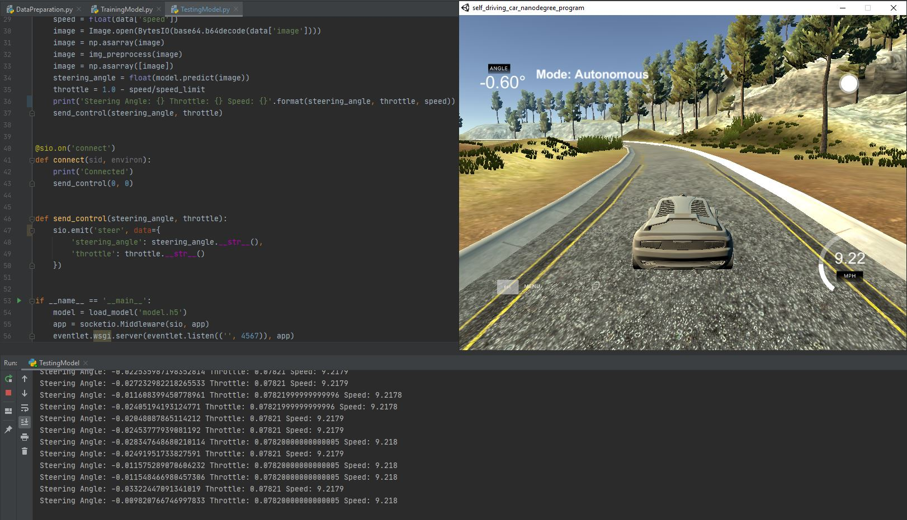
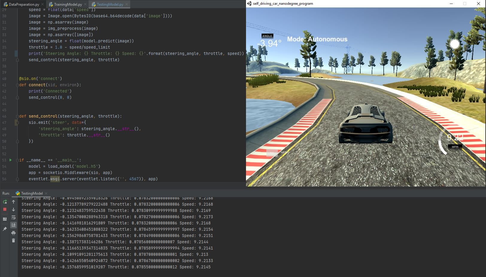
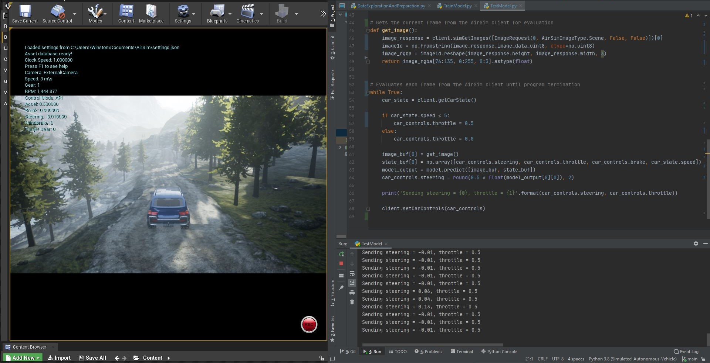

# Simulated-Autonomous-Vehicles
**Training autonomous vehicles for simulation.**

**Guide:**

**+** Each folder in this repository is named using the following convention: (*simulator library*)_(*training method*)

**+** Code that was provided by a tutorial/external source that contributes to preprocessing/training is under the subfolder: *provided_code*

**Projects:**

*Udacity_ConvNet* includes code for preprocessing, training, and testing a convolutional neural network for the Udacity Unity simulation.

*AirSim_ConvNet* includes code for preprocessing, training, and testing a convolutional neural network for the AirSim Unreal Engine simulation.

*AirSim_DeepRL* includes code for preprocessing, training, and testing a deep reinforcement learning model for the AirSim Unreal Engine simulation.

*DeepRacer_DeepRL* includes code for the reward function for a deep reinforcement learning model for the AWS DeepRacer simulation.

